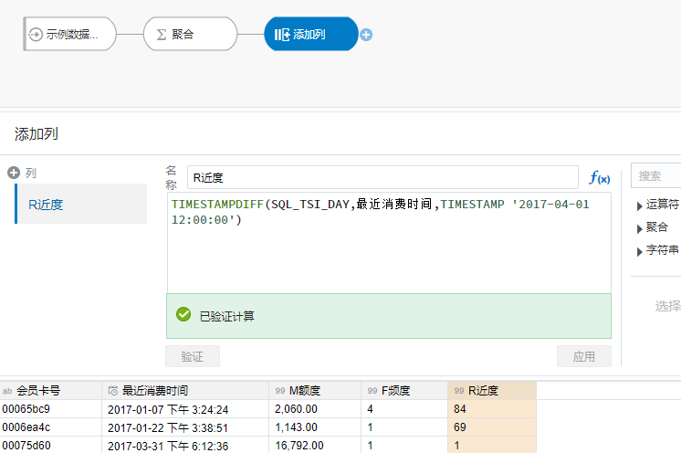

# 如何找到你的高价值客户
## 课程内容

Oracle分析云（OAC）实现RFM用户价值分类模型

### 场景介绍

**客户管理上面临的业务痛点**
* **拉新成本急剧上升**：线上拉新成本首次接近线下拉新，“流量时代”进入瓶颈期
* **忠诚客户不再“忠诚”**：忠诚客户流失，极大影响了销售额与利润
* **营销找不到”关键客户”**：营销费用一般占企业销售额的10%，目标客户缺失浪费企业资金
* **缺乏客户统一管理平台**：客户相关数据无法转化成业务洞察，数据无法发挥业务价值

**通过RFM模型找到高价值客户**

根据美国数据库营销研究所Arthur Hughes的研究，客户数据中有三个神奇的要素构成了数据分析最好的指标：

* 最近一次消费（近度，Recency）
* 消费频率（频度，Frequency）
* 消费金额(（额度，Monetary）

通过这3个指标划分客户价值，从而为更多的营销决策提供支持。

| R | F | M | 分类 | 策略 |
| ------| ------| ------| ------| ------|
|	高	|	高	|	高	|	最佳客户	|	定向发送差异类商品，促销信息	|
|	高	|	高	|	低	|	忠诚客户	|	满就送、促销组合推荐	|
|	低	|	低	|	高	|	高消费客户	|	建立忠诚度	|
|	一般	|	一般	|	一般	|	一般价值客户	|	给予特定的优惠政策	|
|	低	|	低	|	低	|	廉价客户	|	及时止损	|

### 案例介绍

本案例中，客户是一家大型购物商场，希望从销售数据中发掘出高价值客户，以帮助店铺有针对性地进行营销活动。

客户提供了约10万条售卖数据，我们将用其中4列数据，应用RFM模型对用户进行细分。

|	会员卡号	|	消费时间	|	消费金额	|	单据号	|
| ------| ------| ------| ------| 
|	9ede9f7e	|	2017/1/1 10:09	|	359.1	|	25bb	|
|	……	|	……	|	……	|	……	|
|	be031b20	|	2017/3/31 22:19	|	1520.00	|	cd6e	|

### 提前准备

* OAC实例地址 `https://xxxx.oraclecloud.com`
* OAC实例账号、密码
* 实例数据集，点击链接下载到电脑 [示例数据集_会员消费明细](file/示例数据集_会员消费明细.xlsx)

## 第1步：登录分析云平台

打开OAC地址，出现登录界面

输入以下信息： 用户名、 密码

点击**登录**，即可进入分析云平台。

 
 
## 第2步：创建数据流
 
点击主页->**创建**按钮

在弹出的面板中选择**数据流**

 

此时弹出**添加数据集**界面，点击**创建数据集**按钮，

 

此时进入**创建数据集**界面

## 第3步：从文件创建数据集
 
在创建数据集窗口，点击**上传文件**按钮

 

找到您想上传的文件，选择后点击**打开**按钮

 

此时开始上传文件

## 第4步：保存数据集

上传完成后进入数据预览界面

点击**添加**，重新回到数据流界面

 

## 第5步：数据聚合

点击**添加**按钮 ，在菜单中选择**聚合**

 

对分组方式和聚合进行更改：
* 分组方式中只保留**会员卡号**

 

* 点击**添加聚合**，修改**函数**和**列名**，最终效果如下如下

 

## 第6步：计算最近购买时间

在聚合后添加**添加列**节点，先将名称设置为**R近度**，在下侧的函数区域输入以下函数

```
<copy>
TIMESTAMPDIFF(SQL_TSI_DAY,最近消费时间,TIMESTAMP '2017-04-01 12:00:00')
</copy>
```

 

点击**验证**，如果公式正确，会弹出**已验证计算**，验证成功后，点击**应用**按钮

## 第7步：评估RFM得分

在添加列后选择**收集器**节点，收集器负责将数据分组

在收集器的选择列中选择**R近度**，随后在方法中选取**等高**（您可根据实际情况选择手动）

 

针对依次操作，再添加两个收集器生成**F频次**、**M金额**的对应得分，生成如下画面。

 

## 第8步：添加总得分

选择**添加列**节点，先将名称设置为**RFM总得分**，在下侧的函数区域输入函数

```
<copy>
M得分*100+F得分*10+R得分
</copy>
```

点击**验证**，验证成功后，点击**应用**按钮

 

## 第9步：添加客户价值标签

随后再次添加列，添加名称**RFM标签**，分类判断客户价值。在函数框区域输入判断值如下：

```
<copy>
CASE WHEN RFM总得分 = '441' THEN '重要价值客户'
WHEN RFM总得分 = '114' THEN '丢掉的低价值客户'
WHEN RFM总得分 = '444' THEN '丢掉的高价值客户'
WHEN RFM总得分 = '443' THEN '几乎丢掉的用户'
WHEN F得分 ='4' THEN '忠诚客户'
WHEN M得分 ='4' THEN '多金客户'
ELSE  '一般价值客户' end 
</copy> 
```

 

## 第10步：保存数据

选择**保存数据**节点，输入名称：**会员消费RFM分析**

 

## 第11步：保存数据流

点击右上角**保存**，提示输入数据流名称，输入名称：**会员RFM分析**，点击**确定**

 

## 第12步：运行数据流

点击右上角**运行数据流**，运行完成后会有一个绿色的提示：数据流“会员RFM分析完成”

 

此时，在数据集中就可以看到生成的数据集


## 更多教程

* [目前没有](http://docs.oracle.com)

## Acknowledgements
* **作者：Oracle SE Hub Interactive** 
* **最近更新：2020年7月9日** 
