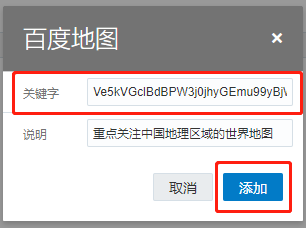

# Oracle分析云（OAC）配置百度地图

## 课程内容

本次课程中，我们将介绍如何在OAC中配置和使用百度地图。

### 提前准备

* OAC实例地址 `https://xxxx.oraclecloud.com`
* OAC实例账号、密码
* 百度账号

## 第1步：申请百度地图AK码

点击链接：[http://lbsyun.baidu.com/apiconsole/center#/home](http://lbsyun.baidu.com/apiconsole/center#/home)

此时进入百度地图开放平台的控制台

点击左侧**应用管理**→**我的应用**

 
 
点击**创建应用**，进入配置页面

* **应用名称**：输入任意名称

* **应用类型**：浏览器端

* **Referer白名单**：如果无特殊需求，填入“*”即可

其他内容保持默认，点击**提交**

  
 
提交后会返回我的应用界面，此时可以看到已生成的应用

点击**访问应用（AK）**可以复制AK码

   
 
## 第2步：添加百度地图

*注意：同一个OAC实例中，地图只需要设置一次，多人操作时有一人成功即可*

在OAC主页，点击左上角菜单图标，弹出侧边栏，点击**控制台**，进入控制台

点击**地图**，进入扩展管理页面

   

点击**背景标签**，在地图背景下面点击**添加背景**按钮，点击**百度地图**选项

   
 
此时弹出窗口，把上一步创建的AK码填入**关键词**窗格，点击**添加**按钮

   
 
添加后在**地图背景**列表中会出现百度地图

   
 
## 第3步：添加安全域

使用百度地图需要访问百度域名下的资源，因此需要将百度域名添加到安全域下，安全域用于允许对特定内容的访问。

在控制台点击**安全域**图标，进入安全域设置界面
 
   
 
在安全域当中点击**添加域**按钮，填写以下四项内容（顺序随意）：

```
<copy>
*.map.bdimg.com
</copy>
```

```
<copy>
*.bdimg.com
</copy>
```

```
<copy>
*.map.baidu.com
</copy>
```

```
<copy>
*.bdstatic.com
</copy>
```

点选**图像**和**脚本**的勾选框，设置效果如下：

   
 
至此，百度地图设置已完成。

## 第4步：使用百度地图

创建地图可视化，把 *经纬度*/*城市名称*/*国家名称*/*国家代码* 等地理字段放入**类别(位置)**，系统会自动识别放入的内容，并转换为地理信息显示在地图上

   
 
在左下角属性窗格，点击**地图**标签，点击**背景地图**下拉菜单，选择**百度地图**

   
 
地图背景切换为百度地图

   
 
在左下角属性窗格，点击**数据层**标签，可以设置更多地图样式，如热力图等
 
   

## 更多教程

* [目前没有](http://docs.oracle.com)

## Acknowledgements
* **作者：Oracle SE Hub Interactive** 
* **最近更新：2020年7月23日** 
